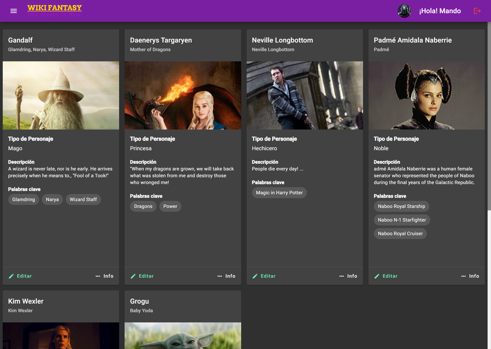

  

# Wiki Fantasy

Es un ejercicio de Angular, implementando varias tecnologías para manejar las funciones de un CRUD.
El sitio hace alusión a unwiki de personajes de fantasía.

Puedes verlo aquí: https://wiki-fantasy.web.app

## 🔍 Vistas
 

### 💻 Desktop
#

  
  
  

<!-- ### 📱 Mobile

  

 -->

## 📌 Stack
#

## 🧑‍💻 Autor
#

- **Niver Mtz** - [@NiverMtz](https://github.com/NiverMtz)

## 📥Install
#

1. CLonar el proyecto
2. Ejecutar `npm install`
3. Levantar backend `npm run backend`
4. Ejecutar la app `npm start` o bien `ng serve -o`
